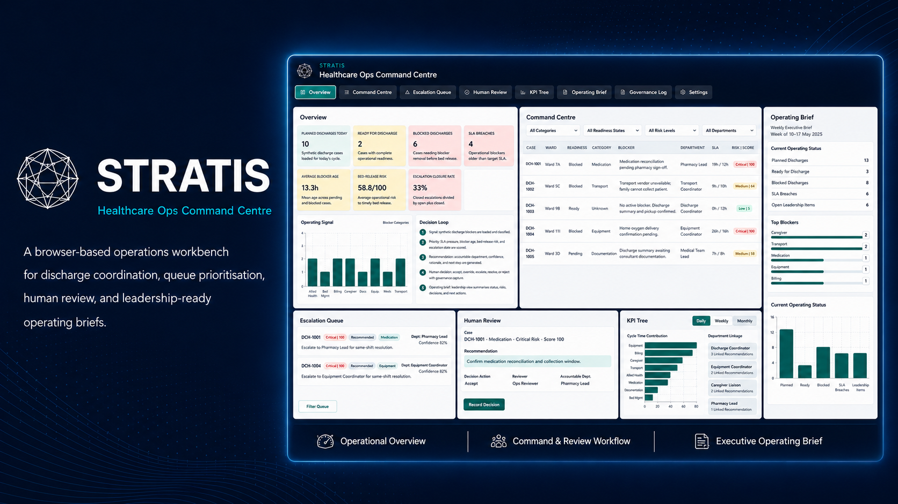
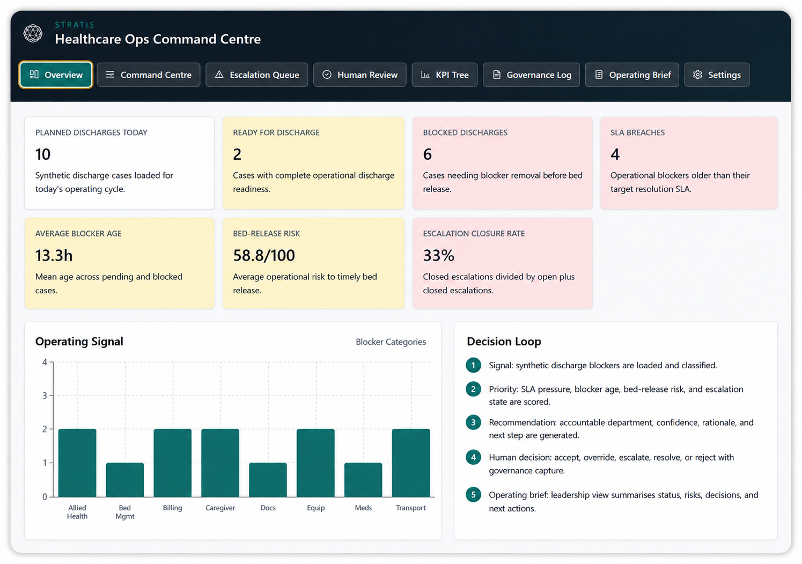
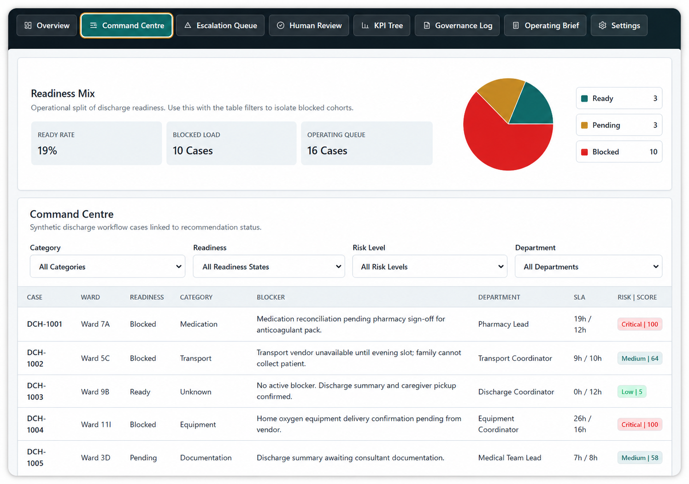
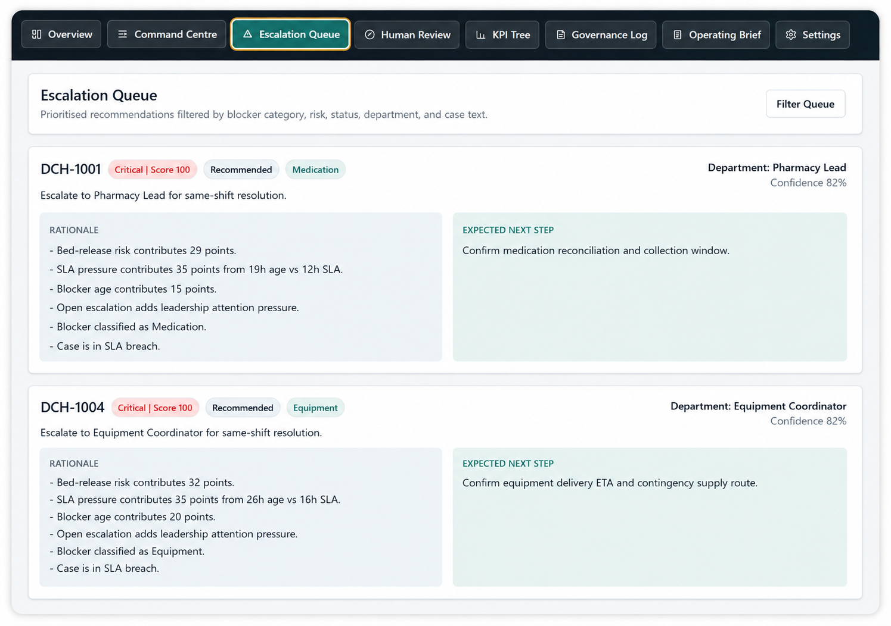
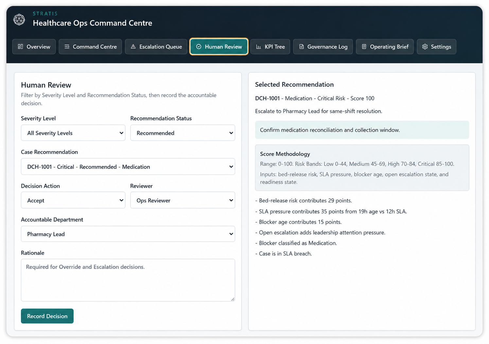
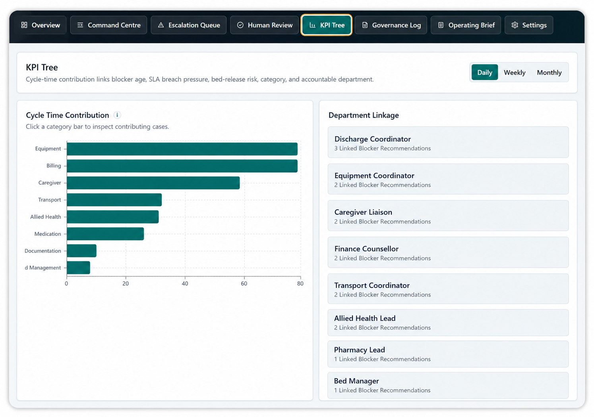
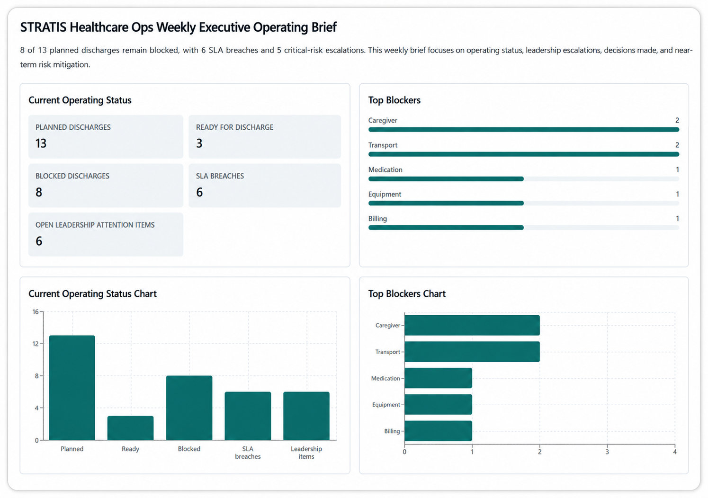

# STRATIS Healthcare Ops Command Centre

**Command centre for regulated healthcare operations.**

STRATIS Healthcare Ops Command Centre is a static, browser-based operations workbench that demonstrates how discharge coordination can move beyond passive dashboarding into a structured operating decision loop.

> Signal → Blocker classification → Risk/SLA prioritisation → Recommendation → Human decision → Escalation/action → Outcome → Governance log → Operating brief

The MVP uses synthetic discharge workflow data only. It does not use real patient data, does not process PHI, does not make clinical diagnoses or treatment recommendations, and does not require an API key or backend.

<p align="center">
  
</p>

---

## Product thesis

Regulated healthcare operations need more than operational dashboards. They need decision systems that make blockers visible, rank escalation urgency, preserve human judgement, and generate leadership-ready operating briefs with an auditable trail.

STRATIS Healthcare Ops Command Centre demonstrates how deterministic rules, human-in-the-loop review, and structured operating briefs can support accountable non-clinical workflow decisions while keeping the governance boundary explicit.

The product is intentionally scoped as an operations decision-support artefact:

- It supports discharge workflow visibility and escalation prioritisation.
- It uses synthetic operational data only.
- It keeps blocker classification, risk scoring, and recommendations deterministic and inspectable.
- It requires human review for material workflow decisions.
- It preserves recommendation and decision events for auditability.
- It generates operating briefs from current local operating state.

---

## What this demonstrates

STRATIS Healthcare Ops Command Centre is a portfolio-grade product build that demonstrates:

- Healthcare operations workflow design.
- Regulated decision-support thinking.
- Human-in-the-loop operating governance.
- Rule-based blocker classification and prioritisation.
- SLA and escalation queue design.
- KPI tree and operational root-cause mapping.
- Governance log design and audit-trail preservation.
- Executive operating brief generation.
- Static-site deployment through GitHub Pages.

The project is not clinical AI. It is designed to show how operational decision systems can be made more structured, reviewable, and accountable without crossing into clinical diagnosis, treatment recommendation, or production healthcare integration.

---

## Core operating loop

```text
Signal
  ↓
Blocker classification
  ↓
Risk/SLA prioritisation
  ↓
Recommendation
  ↓
Human decision
  ↓
Escalation/action
  ↓
Outcome
  ↓
Governance log
  ↓
Operating brief
```

This loop is the product differentiator. The application does not only show operational metrics; it connects those metrics to ownership, decision rationale, escalation status, governance events, and leadership-ready reporting.

---

## Core use cases

| Use case | What the product supports |
|---|---|
| Discharge workflow monitoring | Track readiness, blockers, SLA breaches, blocker ageing, and bed-release risk. |
| Escalation prioritisation | Rank operational cases using transparent deterministic scoring rules. |
| Human-in-the-loop review | Accept, override, escalate, resolve, or reject operational recommendations. |
| Governance logging | Record recommendation, decision, override, escalation, resolution, reset, and brief-generation events. |
| KPI tree analysis | Link discharge cycle-time pressure to blocker categories, accountable departments, SLA pressure, and bed-release risk. |
| Operating briefs | Generate Daily, Weekly, or Monthly operating briefs in Executive or Detailed mode. |
| Export and reuse | Export operating briefs and synthetic workflow data for documentation, review, or portfolio presentation. |

---

## Key features

### 1. Synthetic discharge workflow dataset

The application ships with built-in synthetic discharge workflow data. It is designed to demonstrate operational scenarios without exposing real patient data, PHI, or confidential healthcare operations information.

### 2. Operations overview

The Overview dashboard summarises planned discharges, ready cases, blocked cases, SLA breaches, average blocker age, bed-release risk, escalation closure, and operating signal patterns.

### 3. Command Centre table

The Command Centre surfaces discharge readiness, blocker status, risk scores, SLA pressure, and accountable departments in a filterable operating table.

### 4. Deterministic blocker classification

The app classifies blockers across operational categories such as Medication, Documentation, Transport, Caregiver, Billing, Allied Health, Equipment, Bed Management, and Unknown. Classification is rule-based in the MVP, making the logic inspectable and testable.

### 5. Prioritised escalation queue

The escalation queue ranks cases using transparent scoring logic based on operational urgency, SLA risk, blocker age, capacity impact, and confidence.

### 6. Recommendation cards

Each case can include a recommendation with recommended action, rationale, accountable owner, confidence, expected next step, and risk/SLA context.

### 7. Human review actions

Users can accept, override, escalate, resolve, or reject recommendations. Overrides and escalations require rationale capture so that human judgement is visible rather than silently replacing the deterministic recommendation.

### 8. Governance log

The browser-local governance log records recommendation, decision, override, escalation, resolution, rejection, reset, and brief-generation events. Governance events are displayed as readable audit cards with filtering and removable active filter chips.

### 9. KPI tree

The KPI tree links discharge cycle-time pressure to blocker categories, accountable departments, SLA breaches, bed-release risk, and contributing case patterns. Daily, Weekly, and Monthly views help distinguish immediate pressure from recurring operating patterns.

### 10. Operating briefs

The app generates Daily, Weekly, and Monthly operating briefs in Executive or Detailed mode. Users can preview briefs as formatted text or Markdown and export them for reuse in operating reviews or portfolio documentation.

### 11. Configurable governance taxonomy

The frontend governance taxonomy can be configured for event types and categories. Duplicate checks help prevent equivalent labels from being added with different spacing or casing.

### 12. CSV export

Synthetic cases can be exported as CSV for further analysis or demonstration.

### 13. Light and dark mode

The visual system includes light and dark mode settings aligned to the broader STRATIS workbench family.

### 14. Static deployment

The application is built for GitHub Pages deployment through GitHub Actions and does not require a backend for the MVP.

---

## Application screenshots

<table>
  <tr>
    <td width="33%" align="center" valign="top">
      
    </td>
    <td width="33%" align="center" valign="top">
      
    </td>
    <td width="33%" align="center" valign="top">
      
    </td>
  </tr>
  <tr>
    <td width="33%" valign="top">
      <sub>
        <strong>Overview Dashboard</strong><br>
        Shows discharge readiness, blocker status, SLA pressure, bed-release risk, and operational performance at a glance.
      </sub>
    </td>
    <td width="33%" valign="top">
      <sub>
        <strong>Command Centre</strong><br>
        Surfaces discharge readiness, blocker status, risk scores, SLA pressure, and accountable departments in a filterable operating table.
      </sub>
    </td>
    <td width="33%" valign="top">
      <sub>
        <strong>Escalation Queue</strong><br>
        Prioritises operational cases using transparent scoring rules and identifies the next accountable action.
      </sub>
    </td>
  </tr>
</table>

<table>
  <tr>
    <td width="33%" align="center" valign="top">
      
    </td>
    <td width="33%" align="center" valign="top">
      
    </td>
    <td width="33%" align="center" valign="top">
      
    </td>
  </tr>
  <tr>
    <td width="33%" valign="top">
      <sub>
        <strong>Human Review</strong><br>
        Captures accept, override, escalate, resolve, or reject decisions with rationale and governance traceability.
      </sub>
    </td>
    <td width="33%" valign="top">
      <sub>
        <strong>KPI Tree</strong><br>
        Links discharge cycle-time pressure to blocker categories, accountable departments, SLA breaches, bed-release risk, and contributing case patterns.
      </sub>
    </td>
    <td width="33%" valign="top">
      <sub>
        <strong>Operating Brief</strong><br>
        Converts operating state into Daily, Weekly, or Monthly leadership-ready briefs in Executive or Detailed mode.
      </sub>
    </td>
  </tr>
</table>

---

## Tech stack

| Layer | Technology |
|---|---|
| Frontend | React |
| Language | TypeScript strict mode |
| Build tool | Vite |
| Styling | Tailwind CSS |
| Charts | Recharts |
| CSV handling | Papa Parse |
| Brief export | Markdown, client-side DOCX, client-side PDF |
| PDF rendering | html2canvas, jsPDF |
| Persistence | LocalStorage |
| Testing | Vitest |
| Deployment | GitHub Actions and GitHub Pages |

---

## Performance notes

The app separates chart-heavy functionality from the core interface where practical. Report export is handled client-side to preserve static deployability; PDF export is acceptable for MVP demonstration but should be reassessed if production-grade pagination, archival fidelity, or controlled report storage becomes a requirement.

---

## Getting started

STRATIS Healthcare Ops Command Centre is a static browser-based application built with React, Vite, TypeScript, and Tailwind CSS.

Before running the project locally, ensure you have Node.js 18 or later, npm, and Git installed.

```bash
node --version
npm --version
git --version
```

Clone the repository and move into the project directory:

```bash
git clone https://github.com/hanqe8/stratis-healthcare-op-dashboard.git
cd stratis-healthcare-op-dashboard
```

Install dependencies:

```bash
npm install
```

Run the development server:

```bash
npm run dev
```

After the development server starts, open the local URL shown in your terminal. Vite commonly serves the app at:

```bash
http://localhost:5173
```

Run the test suite:

```bash
npm test
```

Build the static site:

```bash
npm run build
```

Preview the production build locally:

```bash
npm run preview
```

---

## Recommended reviewer walkthrough

1. Open the Overview dashboard.
2. Review planned discharges, blocked cases, SLA breaches, and bed-release risk.
3. Open the Command Centre table and inspect blocker classifications.
4. Review the Escalation Queue and priority ordering.
5. Select a case in Human Review.
6. Accept, override, escalate, resolve, or reject the recommendation.
7. Confirm that the action appears in the Governance Log.
8. Open the KPI Tree and review Daily, Weekly, and Monthly views.
9. Generate an Executive operating brief.
10. Switch to Detailed mode and inspect the reasoning trail.
11. Export the brief.
12. Export synthetic cases as CSV.

This walkthrough demonstrates the complete operating loop from signal detection to leadership-ready reporting.

---

## Governance boundary

This MVP is an operations decision-support artefact.

It does not:

- process PHI;
- include real patient data;
- make clinical diagnoses;
- recommend treatment;
- replace clinical or operational judgement;
- provide medical advice;
- require an API key;
- require a backend.

All recommendations are deterministic operational suggestions based on synthetic workflow data and require human review for material workflow decisions.

---

## Data and privacy

This repository and public demo should only use synthetic, public, or non-confidential data.

Do not upload, paste, or commit:

- real patient data;
- PHI;
- confidential healthcare operations data;
- employer-owned documents;
- proprietary datasets;
- API keys;
- credentials;
- private operational logs.

The MVP is designed for portfolio demonstration and product evaluation. It should not be treated as an enterprise-secure healthcare operations system.

---

## Documentation

| Document | Purpose |
|---|---|
| [PRD](docs/prd.md) | Product requirements, user stories, scope, acceptance criteria, and roadmap |
| [Product Brief](docs/product-brief.md) | Product thesis, positioning, and portfolio rationale |
| [Architecture](docs/architecture.md) | Static app architecture and module boundaries |
| [KPI Tree](docs/kpi-tree.md) | Metric hierarchy and operational root-cause mapping |
| [Model Card](docs/model-card.md) | Rule-based model scope, assumptions, and limitations |
| [Human-in-the-Loop Design](docs/human-in-the-loop-design.md) | Human review, override, escalation, and rationale design |
| [Governance Log Design](docs/governance-log-design.md) | Event model, audit logic, and governance trail |
| [Data Dictionary](docs/data-dictionary.md) | Synthetic dataset fields and definitions |
| [Roadmap](docs/roadmap.md) | Planned feature evolution |

---

## Testing

The test suite should focus on externally visible behaviour and product-critical logic.

Recommended test coverage:

- Blocker classification.
- Priority scoring.
- Recommendation generation.
- Governance event creation.
- Brief generation.
- Taxonomy duplicate checks.
- CSV export behaviour.
- Filtering and sorting logic.
- Export artifact smoke tests for Markdown, DOCX, and PDF paths.

Run tests with:

```bash
npm test
```

---

## Roadmap

| Theme | Description |
|---|---|
| CSV import UI and schema validation | Allow users to import their own synthetic or non-confidential operational datasets. |
| Governance log export bundle | Export governance events for review, documentation, or operating packs. |
| Scenario filters | Add richer filters by ward, owner, service line, blocker type, and reporting period. |
| Optional AI-generated narrative | Add AI-generated operating narrative with deterministic fallback and human review. |
| IndexedDB persistence | Move from LocalStorage to IndexedDB/Dexie for more robust local project storage. |
| Accessibility hardening | Improve keyboard workflows, focus states, table navigation, and screen-reader support. |
| Screenshot and demo polish | Add demo GIFs and a more complete Product Labs case study page. |

---

## Current limitations

- Synthetic data only.
- No PHI or real patient data support.
- No backend storage.
- No authentication.
- No real EHR integration.
- No live operational feeds.
- No autonomous AI actions.
- No clinical diagnosis or treatment recommendation.
- LocalStorage is suitable for MVP use but not enterprise-grade persistence.
- Operating recommendations are deterministic and simplified for portfolio demonstration.
- Client-side PDF export may have formatting limitations compared with server-rendered reports.

---

## Repository status

This is an MVP-stage product build. The current priority is to strengthen test coverage, accessibility, persistence robustness, sample-data realism, and portfolio case-study integration.

---

## License

Add a license before broader public use. MIT is a reasonable default for an open portfolio project unless stronger restrictions are preferred.
